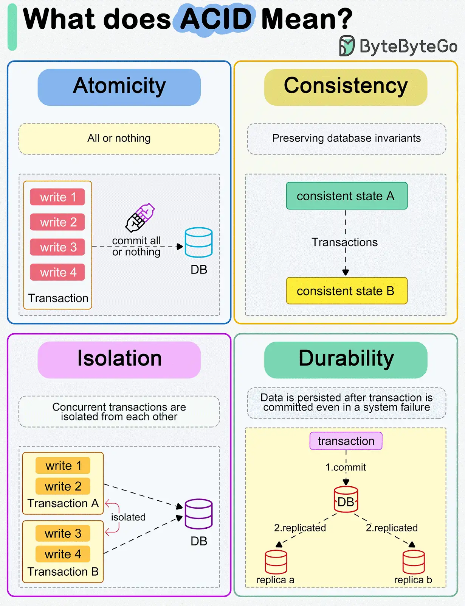
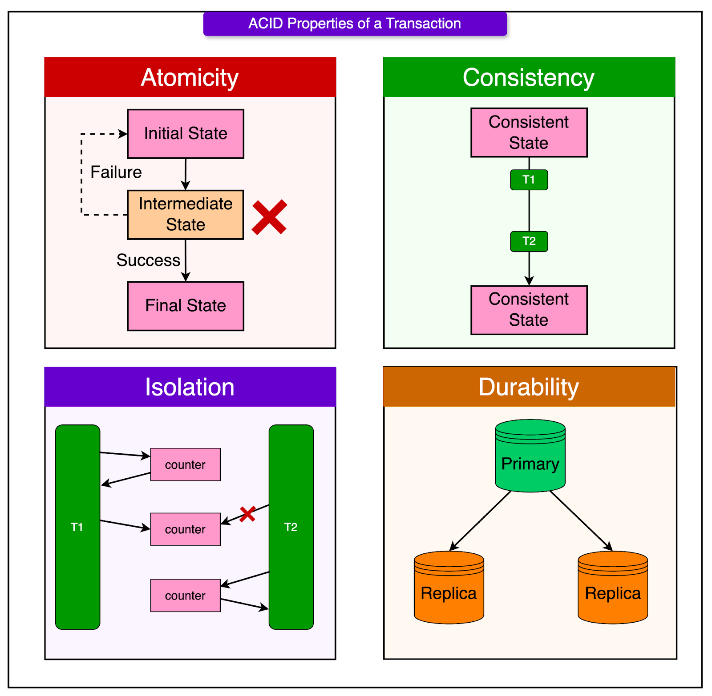
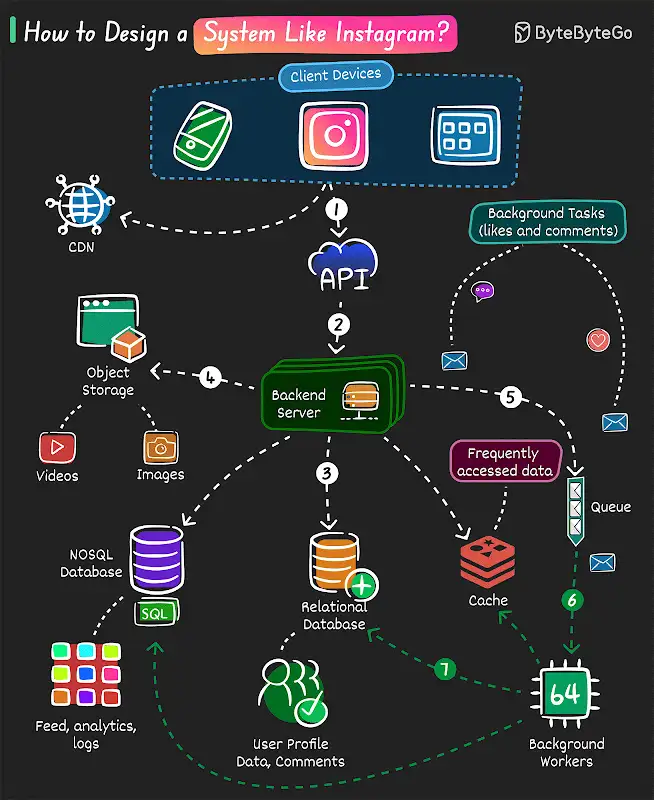
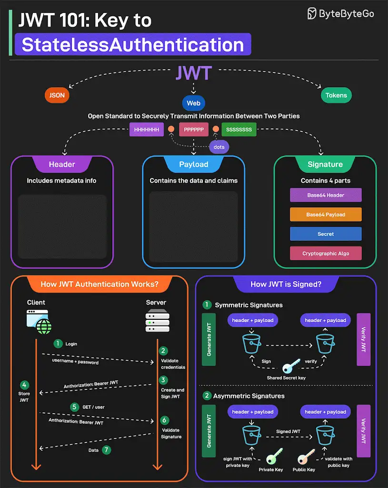

## Base de données

## Design

## Authentication

## HTTP methods

- ACID.png
- 'HTTP methods.webp'
- ACID.webp
- 'HTTP Status code.jpg'
- 'API design.webp'
- instagram.webp
- 'API performance.jpg'
- JWT.jpg
- 'API security.webp'
- JWT.webp
- 'API testing.webp'
- 'Linux commands.jpg'
- browser-storage.png
- 'Linux Files Permissions.webp'
- 'Clean Code Principles.webp'
- 'Linux File System.webp'
- 'clean code tips.gif'
- 'OOP patterns.webp'
- containerization.webp
- 'Pagination in API Design.webp'
- 'cyber attacks.jpg'
- 'proxy - reverse-proxy.webp'
- 'database performance.webp'
- 'REST API design Best Practices.gif'
- database_simplification.png
- 'semantic versioning.gif'
- 'data structure.webp'
- 'software architecture roadmap.webp'
- deployment.webp
- 'SQL joins.png'
- 'design patterns cheatsheet.webp'
- 'SQL Learning.webp'
- 'design patterns.webp'
- SQL.webp
- DNS-Record-Types.webp
- SSO.webp
- docker.webp
- 'system design concepts.webp'
- Git_1280x1425.gif
- visa.webp
- google.com.webp
